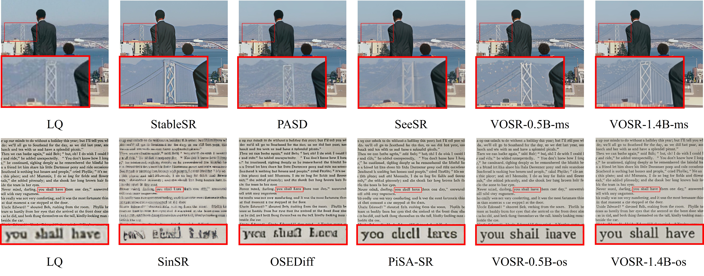
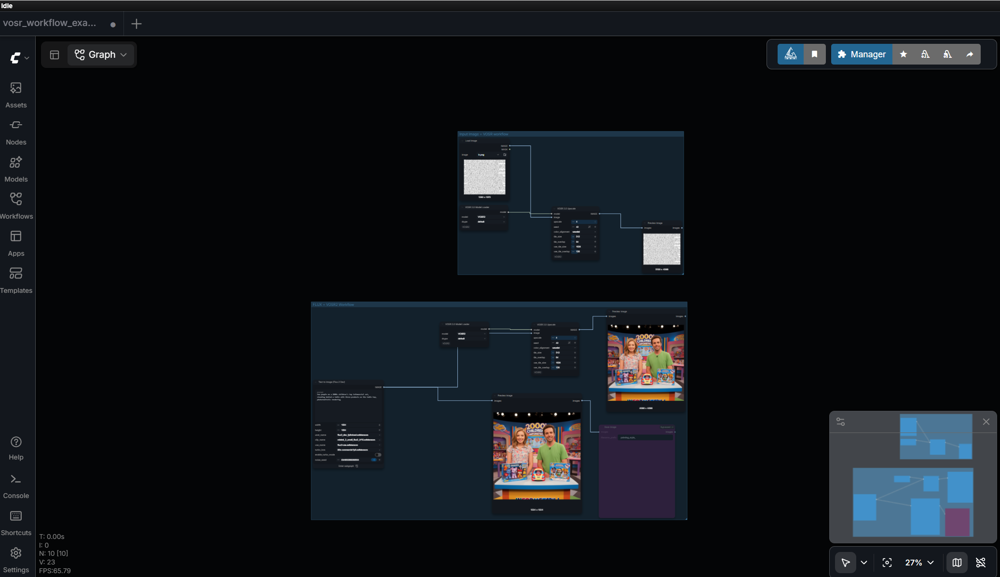

# ComfyUI-VOSR2

ComfyUI nodes for **VOSR 2.0** — the one-step, 1.4B-parameter image
super-resolution model (LightningDiT + Qwen-Image 2D VAE + DINOv2-L
conditioning). This is a standalone community package; it is **not** part of the
upstream [`cswry/VOSR`](https://github.com/cswry/VOSR) repository.

- Upstream code: <https://github.com/cswry/VOSR>
- Upstream weights: <https://huggingface.co/CSWRY/VOSR>
- This node package: <https://github.com/ylchen333/ComfyUI-VOSR2>


**The model files download themselves on first use.** The first time you run the
**VOSR 2.0 Model Loader**, any missing component is fetched from the pinned
[`CSWRY/VOSR`](https://huggingface.co/CSWRY/VOSR) Hugging Face repo into your
ComfyUI `models/` directory (~7 GB total), thus the first run will take a second. Nothing downloads at import or
validation time, only the one pinned repo is ever contacted, and `torch.hub` is
never used. If you prefer to place the files by hand, see
[Model files](#model-files) — the loader skips the download whenever they are
already present.

<!-- ---
 -->
---

## Nodes

Both appear under **`image/upscaling/VOSR2`**.

### VOSR 2.0 Model Loader (`VOSR2ModelLoader`)

Loads a VOSR 2.0 bundle and returns a `VOSR2_MODEL` object. Split from the
upscale node so that queued images do not rebuild several GB of weights.

| Input | Default | Notes |
|---|---|---|
| `model` | `VOSR2` | Bundle folder under `models/vosr2/` — the DiT plus its matched VAE and vision encoder |
| `dtype` | `default` | `default` / `fp16` / `bf16` for the DiT + vision encoder. The VAE always runs in fp32. |

VOSR 2.0 is a **fixed DiT + VAE + vision-encoder set** — the DiT only works with
the specific Qwen 2D VAE it was trained against, so the VAE and vision encoder
aren't separate inputs; they live inside the bundle folder. Leave `model` on
`VOSR2` unless you've added your own bundle. On the first run any missing part is
downloaded from `CSWRY/VOSR`; `args.json` is then validated against the fixed
VOSR 2.0 architecture before anything is constructed — an incompatible checkpoint
fails loudly instead of loading partially.

### VOSR 2.0 Upscale (`VOSR2Upscale`)

One-step super-resolution on an `IMAGE` batch.

| Input | Default | Range | Notes |
|---|---:|---|---|
| `model` | — | `VOSR2_MODEL` | From the loader |
| `image` | — | `IMAGE` | Single image or batch |
| `upscale` | `4` | `1`–`4` | Exact output multiplier |
| `seed` | `42` | ≥ 0 | Latent-noise seed; batch item *i* uses `seed + i` |
| `color_alignment` | `wavelet` | `wavelet` / `adain` / `none` | Post-process against the bicubic target |
| `tile_size` | `0` | `0`–`4096`, step 64 | DiT pixel tile; `0` disables tiling |
| `tile_overlap` | `32` | `0`–`512`, step 8 | DiT tile overlap |
| `vae_tile_size` | `0` | `0`–`8192`, step 64 | VAE pixel tile; `0` decodes the whole image in one pass |
| `vae_tile_overlap` | `32` | `0`–`512`, step 8 | VAE tile overlap |

**Tiling is not optional above 512 px.** VOSR 2.0 was trained natively at up to
512 px, so whenever the *upscaled* output exceeds 512×512 set `tile_size` (e.g.
`512`) or quality degrades. For outputs much past 1024 px also set
`vae_tile_size` (e.g. `1024`) or the full-image VAE decode will likely OOM.

---

## Model files

> The VAE's latent space is specific to `ema_model.safetensors` — you can't swap
> in a different VAE (unless the VOSR authors release a new matched one). Same for
> the DINOv2-L encoder. All three are one set.

**You normally don't need this section** — the loader downloads everything below
from [`CSWRY/VOSR`](https://huggingface.co/CSWRY/VOSR) the first time it runs. It's
here for offline installs, air-gapped machines, or if you'd rather manage the
files yourself. The loader detects existing files and skips the download.

Because the three pieces are one set, they live in **one bundle folder**,
`models/vosr2/VOSR2/`:

```
ComfyUI/models/vosr2/VOSR2/
├── args.json
├── checkpoints/
│   └── ema_model.safetensors
├── Qwen-Image-vae-2d/
│   ├── config.json
│   └── diffusion_pytorch_model.safetensors
└── dinov2_vitl14.safetensors
```

| File in `CSWRY/VOSR` | Direct download | Put it at |
|---|---|---|
| `VOSR2/args.json` | [link](https://huggingface.co/CSWRY/VOSR/resolve/main/VOSR2/args.json) | `models/vosr2/VOSR2/args.json` |
| `VOSR2/checkpoints/ema_model.safetensors` | [link](https://huggingface.co/CSWRY/VOSR/resolve/main/VOSR2/checkpoints/ema_model.safetensors) | `models/vosr2/VOSR2/checkpoints/ema_model.safetensors` |
| `Qwen-Image-vae-2d/config.json` | [link](https://huggingface.co/CSWRY/VOSR/resolve/main/Qwen-Image-vae-2d/config.json) | `models/vosr2/VOSR2/Qwen-Image-vae-2d/config.json` |
| `Qwen-Image-vae-2d/diffusion_pytorch_model.safetensors` | [link](https://huggingface.co/CSWRY/VOSR/resolve/main/Qwen-Image-vae-2d/diffusion_pytorch_model.safetensors) | `models/vosr2/VOSR2/Qwen-Image-vae-2d/diffusion_pytorch_model.safetensors` |
| `torch_cache/checkpoints/dinov2_vitl14_pretrain.pth` | [link](https://huggingface.co/CSWRY/VOSR/resolve/main/torch_cache/checkpoints/dinov2_vitl14_pretrain.pth) | convert → `models/vosr2/VOSR2/dinov2_vitl14.safetensors` (see below) |

> The `model` dropdown is seeded with `VOSR2` and defaults to it. Drop additional
> bundle folders next to it and they'll appear in the dropdown too (any subfolder
> of `models/vosr2/` with an `args.json`), but only `VOSR2` is auto-downloaded.

The DINOv2-L file in the repo is a raw PyTorch pickle
(`dinov2_vitl14_pretrain.pth`); the loader converts it to
`dinov2_vitl14.safetensors` automatically. To do it by hand, run this where
ComfyUI's Python can `import torch`:

```python
import torch
from safetensors.torch import save_file

sd = torch.load("dinov2_vitl14_pretrain.pth", map_location="cpu", weights_only=True)
save_file({k: v.contiguous() for k, v in sd.items()}, "dinov2_vitl14.safetensors")
```

then place `dinov2_vitl14.safetensors` in `models/vosr2/VOSR2/`. The keys
are the original Meta `facebookresearch/dinov2` names
(`blocks.N.attn.qkv.*`, `blocks.N.ls1.gamma`, …), matching the vendored
architecture in [`models/dinov2.py`](models/dinov2.py) — do **not** use the
Hugging Face `transformers` `facebook/dinov2-large` weights, whose keys differ.

---

## Installation

### Local ComfyUI

You need a reasonably recent ComfyUI (one that ships `comfy_api.latest` — any
build from 2025 onward). The only dependency is `huggingface_hub` (used to fetch
the weights), which already ships with ComfyUI; `safetensors` and `einops` do
too.

**git clone (recommended until the node is on the Comfy Registry)**

```bash
cd ComfyUI/custom_nodes
git clone https://github.com/ylchen333/ComfyUI-VOSR2
# restart ComfyUI
```

Then add a **VOSR 2.0 Model Loader**, leave `model` on `VOSR2`, and run — the
~7 GB bundle downloads from `CSWRY/VOSR` on that first execution and is reused
afterward. (To pre-place it instead, see [Model files](#model-files).)

#### Installing via Git URL

**Manager → Custom Nodes Manager → Install via Git URL** with
`https://github.com/ylchen333/ComfyUI-VOSR2` also works, but recent
ComfyUI-Manager versions gate that button behind **both**:

- `allow_git_url_install = true` in `config.ini` (`[default]` section — the file
  is at `ComfyUI/user/default/ComfyUI-Manager/config.ini`), and
- ComfyUI launched on a loopback address (`--listen 127.0.0.1`, `::1`, or no
  `--listen` at all).

Both are read once at startup, so change them with the server stopped, then
restart. This is a ComfyUI-Manager policy, unrelated to this node — a plain
`git clone` sidesteps it entirely, and once the node is published to
registry.comfy.org it installs through Manager's normal search without either
toggle.

### RunComfy
Via the Custom Nodes Manager, install 0.4.0 (or whatever the latest version is). Then restart.
  
---

## Usage

### Example workflows

- **[`example_workflows/vosr_workflow_examples.json`](example_workflows/vosr_workflow_examples.json)** —
  a drag-and-drop starter file. Drop it onto the ComfyUI canvas to load
  ready-made VOSR 2.0 graphs (loader → upscale, tiling presets already wired).
  The quickest way to get going.
- **`example_workflows/local_workflow.png`** — the same setup running locally in
  ComfyUI, for reference:

  

- **RunComfy** — Link to workflow [here](https://www.runcomfy.com/comfyui-workflows/my-workflows?shared_workflow=764db3d9-242d-87a7-4157-3cd95923fea7).

- **Comfy Cloud** — hosted example-workflow links will be added here once custom nodes are supported on Comfy Cloud.

### Manual setup

1. **VOSR 2.0 Model Loader** — leave `model` on `VOSR2` and `dtype` on `default`
   (use `fp16`/`bf16` to save VRAM).
2. Feed an image into **VOSR 2.0 Upscale** together with the loader's `model`
   output.
3. Set `upscale` (1–4). If the result exceeds 512 px on a side, set
   `tile_size = 512`. If it exceeds ~1024 px, also set `vae_tile_size = 1024`.
4. `color_alignment` defaults to `wavelet`; `adain` or `none` are available for
   comparison.

### Recommended VOSR 2.0 Upscale settings

A solid general-purpose starting point (tiling on, for outputs past 512 px):

| Parameter | Value |
|---|---|
| `upscale` | `4` |
| `seed` | `42` |
| `color_alignment` | `wavelet` |
| `tile_size` | `512` |
| `tile_overlap` | `64` |
| `vae_tile_size` | `1024` |
| `vae_tile_overlap` | `128` |

The node's own defaults keep tiling **off** (`tile_size` / `vae_tile_size` = `0`),
which is only appropriate when the upscaled output stays at or below 512 px — set
the values above for anything larger.

Batches are first-class: item *i* is seeded with `seed + i`, so a batch result
matches running each image separately.

---

## Notes on VRAM and tiling

The upstream authors have no measured tile-size / VRAM table yet, and neither
does this package. Treat these as starting points, not guarantees:

- ≤ 512 px output: no tiling needed.
- ~2048 px output: `tile_size = 512`.
- ~4096 px output: `tile_size = 512`, `vae_tile_size = 1024`.

`fp16` / `bf16` (via the loader's `dtype`) roughly halves DiT + vision-encoder
memory; the Qwen VAE always runs in fp32.

---

## VOSR2 examples


> **Interactive version:** Visit [VOSR 2.0 project page](https://cswry.github.io/vosr2/) and drag-to-reveal slider over each pair.

<!-- <table>
<tr>
<td align="center"><b>Low resolution</b></td>
<td align="center"><b>Upscaled</b></td>
</tr>
<tr>
<td align="center">Building<br></td>
<td align="center">Building<br></td>
</tr>
<tr>
<td align="center">Landscape<br></td>
<td align="center">Landscape<br></td>
</tr>
<tr>
<td align="center">Faces<br></td>
<td align="center">Faces<br></td>
</tr>
<tr>
<td align="center">English text<br></td>
<td align="center">English text<br></td>
</tr>
<tr>
<td align="center">Chinese text<br></td>
<td align="center">Chinese text<br></td>
</tr>
</table> -->

---

## Status

In-progress v1. Done: model discovery/validation, first-run auto-download from
`CSWRY/VOSR`, vendored DiT/VAE/DINOv2 architectures, ComfyUI-managed load/offload
via `ModelPatcher`, untiled and tiled (DiT + VAE) inference, per-item seeded
batching, torch-native `wavelet` / `adain` / `none` color alignment, and a
drag-and-drop example workflow. Not yet done: numeric validation against the
upstream reference, measured VRAM/tile presets, and a confirmed RunComfy /
ComfyUI-Manager install path.

## Licensing

This node package is released under the **Apache License 2.0** (see
[`LICENSE`](LICENSE)), matching upstream VOSR.

The **model weights are downloaded separately** from
[CSWRY/VOSR](https://huggingface.co/CSWRY/VOSR) and carry their own terms —
including the DINOv2 checkpoint (Meta, `facebookresearch/dinov2`) and the
Qwen-Image VAE. Review those before redistribution or commercial use.

## Credits

- **VOSR / VOSR 2.0** — Rongyuan Wu et al. ([cswry/VOSR](https://github.com/cswry/VOSR))
- **DINOv2** — Meta AI ([facebookresearch/dinov2](https://github.com/facebookresearch/dinov2))
- **Qwen-Image VAE** — Qwen team
- ComfyUI integration: this repository
